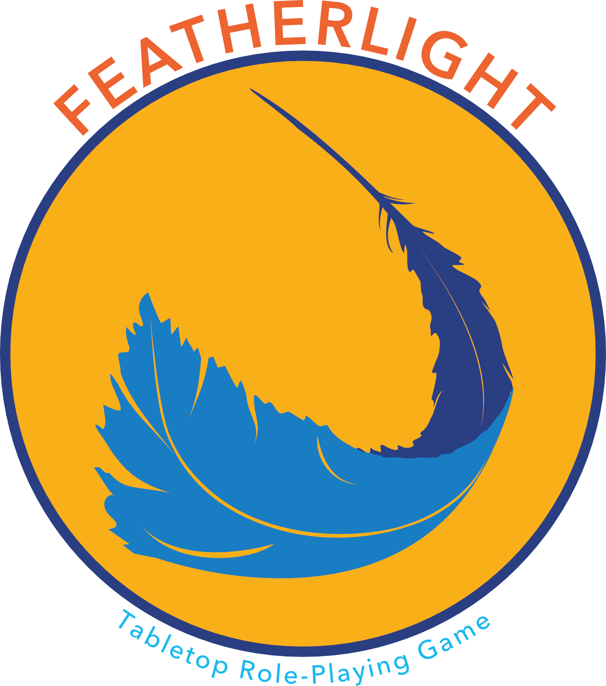

## Toothsome Games

> **Toothsome**: _tüth-səm_ (adjective) of palatable flavor and pleasing texture^[1](https://www.merriam-webster.com/dictionary/toothsome)^

Toothsome Games (TG) is born out of a desire to host a number of interesting--perhaps suprisingly so--games, both role-playing and otherwise. **Featherlight** is the flagship game of TG but there are a number of projects in the works including Dungeons & Dragons 'quick reference' spell cards and some vague ideas for a tabletop role-playing game (TTRPG) about balancing the power afforded by a curse and the erosion of the players' humanity. See the panels below for references to published TG content!

:::{.panel-tabset}
### Featherlight TTRPG

Featherlight is a rules-light, setting-neutral TTRPG. Featherlight is built to be as welcoming as possible for novice TTRPG players while still providing an enjoyable experience for more experienced players. This purpose also helps it be a great starting point for players interested in being the game master but intimidated by "crunchier" systems where it can feel impossible to know the rules well enough to be the arbiter of them in a game. Additionally, because the mechanics are so flexible, they can be easily applied to any world where you want to spend some more time (e.g., beloved book series, popular anime, personal OC/homebrew, etc.)!

In short, **Featherlight is built to be the backdrop for you to take big narrative swings in whatever setting sparks the most joy for your table.** Have fun and good luck!

For more details, check out the Featherlight website at [toothsome-games.github.io/featherlight-ttrpg](https://toothsome-games.github.io/featherlight-ttrpg/)

:::

### Note on Artificial Intelligence

AI tools are trained on stolen intellectual property for which the creators will never be credited or compensated. Additionally, human intentionality will always be better for creative projects than random mish-mashes of previous works. Because of this, **AI was not used in <u>any</u> facet of this work.** Please respect this by not feeding any Toothsome Games content (from this website or elsewhere) into those systems. Thanks!
